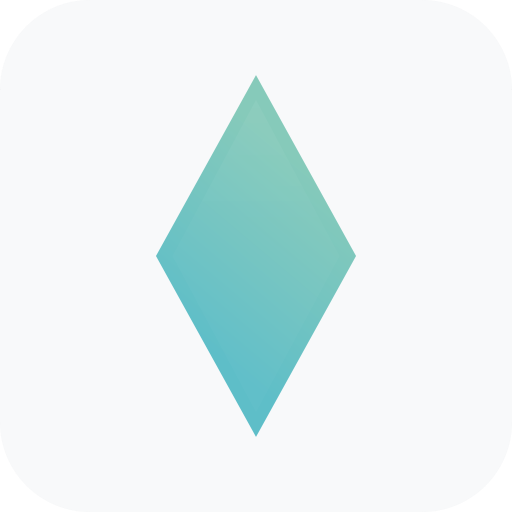
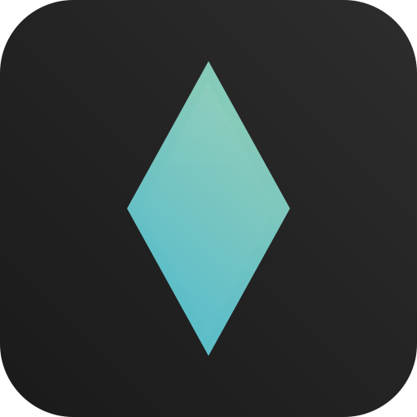

# 💎 Gemstone AI

<div align="center">
  
  
  
</div>
<br><br>
<div align="center">
  &nbsp;&nbsp;&nbsp;&nbsp;&nbsp;
  
  <h3>🌟 Universal AI Chat System with On-Device Intelligence</h3>
  <p>This is a open-source multi-platform AI Chat System written with Kotlin Compose Multiplatform and Python.</p>
</div>

---

## ✨ Key Features

- 🎯 **Universal Platform Support** - Run on Web, Android, iOS, Windows, Linux, and macOS
- 🧠 **On-Device AI** - Privacy-first local AI processing with Python Multiplatform
- 🎨 **Modern UI** - Beautiful, responsive interface built with Compose Multiplatform
- 💾 **Offline Capability** - Full functionality without internet connection
- 🔄 **Real-time Chat** - WebSocket-based real-time messaging
- 📱 **Cross-Platform Sync** - Seamless experience across all devices


## 🚀 Platform Support

<div align="center">
  <table>
    <tr>
      <td align="center">🌐 <strong>Web</strong></td>
      <td align="center">📱 <strong>Android</strong></td>
      <td align="center">🍎 <strong>iOS</strong></td>
    </tr>
    <tr>
      <td align="center">🪟 <strong>Windows</strong></td>
      <td align="center">🐧 <strong>Linux</strong></td>
      <td align="center">🍎 <strong>macOS</strong></td>
    </tr>
  </table>
</div>

> **Note:** Developed with Python Multiplatform

## 🛠️ Technology Stacks

### 🔧 Model Serving API
> **⚡ Note:** Planning to support OpenAI-like API for AI model serving.

- **Transformers/BitsAndBytes & PyTorch** (INT4/INT8)
- **Transformers/AutoGPTQ & PyTorch** (SAFETENSORS)  
- **Llama-cpp-python & Numpy** (GGUF)

### 📱 Mobile/Web Client APP
- **Kotlin Multiplatform Mobile**
- **Compose Multiplatform Mobile**

> **🔮 Note:** Scheduled to adapt Python Multiplatform for On-Device AI model serving.

## 🤖 Supported Models

### 🖥️ Server Models
- **Qwen 3 14b 4bitQ** (BitsAndBytes)
- **To be done...**

### 📱 On-Device Models  
- **Llama 3.1 8B** (llama.cpp)
- **Qwen 3 14b 4bitQ** (llama.cpp)
- **To be done...**

## 📖 API Reference

```json
chat_history = [
    {
        "role": "user",
        "content": "오늘 대전 날씨가 어때?"
    },
    {
        "role": "assistant",
        "content": "",
        "tool_calls": [
            {
                "id": "call_20250614125444",
                "function": {
                    "name": "get_weather",
                    "arguments": {
                        "location": "Daejeon, South Korea",
                        "unit": "celsius"
                    }
                }
            }
        ]
    },
    {
        "role": "tool",
        "tool_call_id": "call_20250614125444",
        "content": "<cached_result:call_20250614125444>"
    },
    {
        "role": "assistant",
        "content": "오늘 대전의 날씨는 다음과 같습니다:\n\n- 🌡️ 온도: 26.3°C (체감 온도: 30.6°C)\n- ☁️ 날씨: 주로 맑음\n- 💧 습도: 81%\n- 💨 바람: 13.8 m/s (북동)\n- 📊 기압: 994 hPa\n\n이 정보는 Open-Meteo에서 제공합니다."
    }
]
```

## 🏗️ APP Architecture

Gemstone AI follows Clean Architecture principles with clear separation of concerns:

```
📁 app/
├── 🎯 domain/           # Business logic and entities
├── 🔄 adapter/          # Controllers and presenters
└── 🛠️ framework/        # UI, database, network, and AI infrastructure
```

<details>
<summary>📁 Detailed Project Structure (Click to expand)</summary>

```
app/
├── domain/
│   ├── entity/
│   │   ├── Message.kt
│   │   ├── ChatSession.kt
│   │   ├── User.kt
│   │   ├── AIModel.kt
│   │   └── value/
│   │       ├── MessageId.kt
│   │       ├── SessionId.kt
│   │       └── Timestamp.kt
│   ├── usecase/
│   │   ├── chat/
│   │   │   ├── SendMessageUseCase.kt
│   │   │   ├── GetChatHistoryUseCase.kt
│   │   │   ├── CreateSessionUseCase.kt
│   │   │   └── DeleteSessionUseCase.kt
│   │   ├── ai/
│   │   │   ├── SwitchAIModelUseCase.kt
│   │   │   ├── DownloadModelUseCase.kt
│   │   │   └── GetAvailableModelsUseCase.kt
│   │   └── user/
│   │       ├── SaveUserPreferencesUseCase.kt
│   │       └── GetUserPreferencesUseCase.kt
│   ├── repository/
│   │   ├── ChatRepository.kt
│   │   ├── AIModelRepository.kt
│   │   └── UserRepository.kt
│   └── service/
│       ├── AIService.kt
│       ├── ValidationService.kt
│       └── NotificationService.kt
├── adapter/
│   ├── controller/
│   │   ├── chat/
│   │   │   ├── ChatController.kt
│   │   │   ├── SessionController.kt
│   │   │   └── dto/
│   │   │       ├── SendMessageRequest.kt
│   │   │       └── CreateSessionRequest.kt
│   │   ├── ai/
│   │   │   ├── AIModelController.kt
│   │   │   └── dto/
│   │   │       └── SwitchModelRequest.kt
│   │   └── settings/
│   │       ├── SettingsController.kt
│   │       └── dto/
│   │           └── UpdatePreferencesRequest.kt
│   ├── presenter/
│   │   ├── chat/
│   │   │   ├── ChatPresenter.kt
│   │   │   ├── SessionPresenter.kt
│   │   │   └── model/
│   │   │       ├── ChatUiState.kt
│   │   │       ├── MessageUiModel.kt
│   │   │       └── SessionUiModel.kt
│   │   ├── ai/
│   │   │   ├── AIModelPresenter.kt
│   │   │   └── model/
│   │   │       ├── AIModelUiState.kt
│   │   │       └── ModelDownloadUiModel.kt
│   │   └── settings/
│   │       ├── SettingsPresenter.kt
│   │       └── model/
│   │           └── SettingsUiState.kt
└── framework/
    ├── ui/
    │   ├── compose/
    │   │   ├── screen/
    │   │   │   ├── chat/
    │   │   │   │   ├── MainScreen.kt
    │   │   │   │   ├── SideScreen.kt
    │   │   │   │   ├── ChatScreen.kt
    │   │   │   │   └── component/
    │   │   │   │       ├── MessageItem.kt
    │   │   │   │       ├── MessageInput.kt
    │   │   │   │       └── SubjectCard.kt
    │   │   │   ├── model/
    │   │   │   │   ├── ModelSelectionScreen.kt
    │   │   │   │   └── component/
    │   │   │   │       ├── ModelItem.kt
    │   │   │   │       └── DownloadProgress.kt
    │   │   │   └── settings/
    │   │   │       ├── SettingsScreen.kt
    │   │   │       └── component/
    │   │   │           └── PreferenceItem.kt
    │   │   ├── navigation/
    │   │   │   ├── AppNavigation.kt
    │   │   │   └── NavigationRoute.kt
    │   │   └── theme/
    │   │       ├── Color.kt
    │   │       ├── Dimen.kt
    │   │       ├── Shape.kt
    │   │       ├── Theme.kt
    │   │       └── Type.kt
    │   └── viewmodel/
    │       ├── ChatViewModel.kt
    │       ├── AIModelViewModel.kt
    │       └── SettingsViewModel.kt
    ├── database/
    │   └── ChatDatabase.kt
    ├── network/
    │   ├── http/
    │   │   ├── HttpClientFactory.kt
    │   │   └── api/
    │   │       ├── ChatApiService.kt
    │   │       └── AIModelApiService.kt
    │   └── websocket/
    │       └── ChatWebSocketClient.kt
    ├── ai/
    │   ├── local/
    │   │   └── LocalModelManager.kt
    │   ├── remote/
    │   │   ├── OpenAIClient.kt
    │   │   ├── AnthropicClient.kt
    │   │   └── HuggingFaceClient.kt
    │   └── common/
    │       └── ModelManager.kt
    └── storage/
        └── FileManager.kt
```

</details>

## 🚀 Installation

### 📋 Prerequisites
- **Git**
- **Python 3.12+**
- **Java 21+** (for Kotlin Multiplatform)
- **Xcode 14+** - For iOS development (macOS only)

### 🔧 Setup

#### 1️⃣ Clone this repository
```bash
git clone https://github.com/thisisthepy/Gemstone.git
cd Gemstone
```

#### 2️⃣ Install Python dependencies
```bash
uv sync
```

#### 3️⃣ Install Llama-cpp-python with CUDA support (Optional)
> For GPU acceleration with NVIDIA cards

```bash
CMAKE_ARGS="-DGGML_CUDA=on -DLLAVA_BUILD=off -DCMAKE_CUDA_ARCHITECTURES=native" \
FORCE_CMAKE=1 uv pip install llama-cpp-python --no-cache-dir --force-reinstall --upgrade
```

#### 4️⃣ Run the server
```bash
python -m api run server
```

## 🎯 Usage

### 🖥️ Desktop Application
```bash
./gradlew :app:run
```

### 📱 Android
```bash
./gradlew :app:installDebug
```

### 🌐 Web
```bash
./gradlew :app:wasmJsBrowserDevelopmentRun
```

### 🍎 iOS
```bash
./gradlew :app:iosSimulatorArm64Test
```

## 🤝 Contributing

We welcome contributions! Please see our [Contributing Guide](CONTRIBUTING.md) for details.

### 🐛 Bug Reports
- Use the [issue tracker](https://github.com/thisisthepy/Gemstone/issues)
- Provide detailed reproduction steps
- Include platform and version information

### 💡 Feature Requests
- Check existing [feature requests](https://github.com/thisisthepy/Gemstone/issues?q=is%3Aissue+is%3Aopen+label%3Aenhancement)
- Propose new ideas with clear use cases
- Consider implementation complexity

## 📄 License

This project is licensed under the MIT License - see the [LICENSE](LICENSE) file for details.

## 🙏 Acknowledgments

- **JetBrains** for Kotlin Multiplatform and Compose
- **Hugging Face** for the Transformers library
- **Llama.cpp** for efficient local model serving
- **Llama-cpp-python** for Python bindings
- **Meta** for Llama models
- **Alibaba** for Qwen models
- **Google** for Gemma models


---

<div align="center">
  <p><strong>🎉 Ready to chat with AI across all your devices!</strong></p>
  <p>
    <a href="https://github.com/thisisthepy/thisisthepy/issues">🐛 Report Bug</a> |
    <a href="">💬 Discuss on Discord</a> |
    <a href="https://github.com/thisisthepy/thisisthepy">⭐ Star on GitHub</a>
  </p>
</div>
